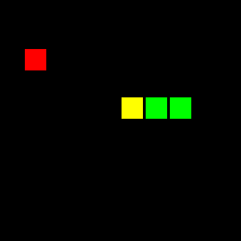

# Snake v01


Implementation of Genetic Algorithm and Q-Learning for creating a Snake AI in Rust.

This has been an attempt at learning the Rust language, and using it as a way to learn some concepts of Machine Learning, Data Parallelism, and Game Design. 

## Demo



## How to play

```
$ git clone https://github.com/const-i/snake_01.git
$ cd snake_01
$ cargo run
```

```
# Blockdrop
# With module
> cargo run --no-default-features --features blockdrop,ledmatrix
# Without module
> cargo run --no-default-features --features blockdrop,piston
```

All game variants:

```
# Just game engine
cargo run --features piston,snake
cargo run --features piston,snake
cargo run --features piston,blockdrop
cargo run --features piston,breakout
cargo run --features piston,pong

# Render on matrix
cargo run --features ledmatrix,snake
cargo run --features ledmatrix,blockdrop
cargo run --features ledmatrix,breakout
cargo run --features ledmatrix,pong

# AI variants
cargo run --features piston,snake,qlearn
cargo run --features piston,snake,genetic
```

### Controls

###### Any game

| Key | Action                                  |
|-----|-----------------------------------------|
| R   | Restart game                            |
| S   | If two LED matrices attaches, swap them |

###### Snake

| Key   | Action                  |
|-------|-------------------------|
| UP    | Change direction: Up    |
| LEFT  | Change direction: Left  |
| DOWN  | Change direction: Down  |
| RIGHT | Change direction: Right |

###### Pong

| Key   | Action                  |
|-------|-------------------------|
| LEFT  | Move upper paddle left  |
| RIGHT | Move upper paddle right |
| A     | Move lower paddle left  |
| D     | Move lower paddle right |

###### Breakout

| Key  | Action            |
|------|-------------------|
| LEFT | Move paddle left  |
| DOWN | Move paddle right |

###### Blockdrop

| Key   | Action          |
|-------|-----------------|
| UP    | Flip piece      |
| LEFT  | Move piece left |
| DOWN  | Move piece down |
| RIGHT | Move piece left |

## License

See the [LICENSE](./LICENSE) file for license rights and limitations.
